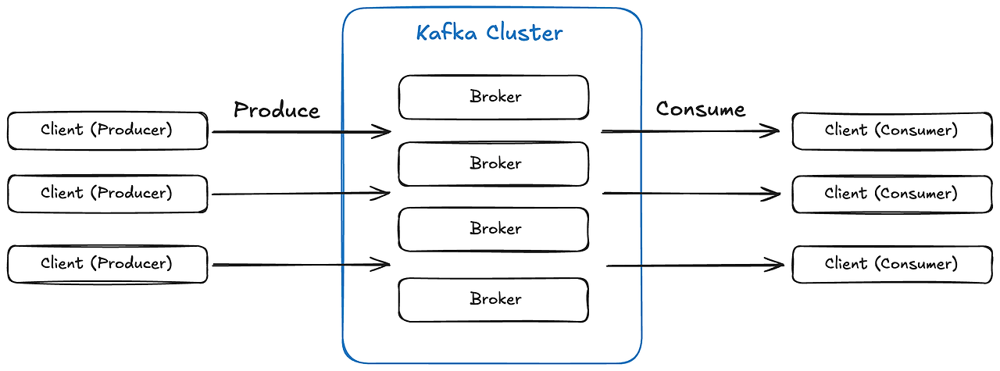

# 1. What is Apache Kafka?

- 공식문서에서 설명하는 Apache Kafka

Apache Kafka is an open-source distributed event streaming platform.

카프카는 ‘분산 이벤트 스트리밍 플랫폼’이다.
 

## What is event streaming?

'event streaming'이란 뭘까?

event streaming is the practice of capturing data in real-time from event sources.
이벤트 스트리밍은 실시간으로 'event source'에서 발생하는 데이터를 캡쳐하는 것.

event source는 'event'가 발생하는 곳으로 DB, Software Application, mobile device 등이 있다.

Event Streaming이란, 실시간으로 발생하는 'event'를 'event stream' 형태로 저장하여 처리하고 필요한 곳에 전달하는 것.

 

이를 통해 다음과 같은 효과를 보장한다.

- 실시간 데이터를 연속적으로 수집, 처리하는 데이터 흐름 보장

- 단순히 데이터를 전달 뿐만이 아닌 데이터를 분석하고 해석하는 구조 제공 (데이터 처리)

- 처리 지연 없이 적절한 시점에 적절한 위치로 데이터 전달
 

## What is event stream? (event? stream?)

**event stream**이란?

**event stream**은 말 그대로, 'event'와 'stream'의 개념을 합친 것.

event : 어떤 일이 발생했다는 사실 (ex : 회원 탈퇴, 주문 취소, 로그인 성공, ...)

stream : 시간에 따라 연속적으로 발행하는 데이터의 흐름

고로 'event stream'은 연속적으로 발생하는 Event의 흐름을 의미한다.

 

Kafka는 Event를 연속적으로 발생하는 stream으로 저장하여 이를 가공 및 처리할 수 있도록 한다.

## What is Kafka 'event streaming platform' meaning?

Kafka는 어떠한 원리로 'Event Streaming Platform'을 구성할까?

Kafka는 다음과 같은 3가지 Core Concept을 사용해서 'Event Streaming Platform'을 구성한다.

1. To publish (write) and subscribe to (read) streams of events.
2. To store streams of events durably and reliably for as long as you want.
3. To process streams of events as they occur or retrospectively.

- Event Stream을 Publish/Subscribe한다. (Pub/Sub 구조)
- 원하는 시간만큼 Event Stream을 안전하게 저장한다.
- 실시간 Event Stream, 과거의 Event Stream을 처리할 수 있다. (실시간 처리, 재처리)

# 2. How does Kafka Work? (Internals, Server-Client)

Kafka는 어떻게 동작하는지 내부 구조(Internal)를 살펴보기.

Kafka is a distributed system consisting of servers and clients that communicate via a high-performance TCP network protocol.

- Kafka는 높은 성능의 TCP Protocol로 통신하는 여러 Server, Client로 구성된 분산 시스템이다.
 

## Servers

Kafka is run as a cluster of one or more servers that can span multiple datacenters or cloud regions. 

- Kafka는 확장 가능한 하나 이상의 서버로 이루어진 'Cluster' 형태로 동작한다.

여기서 Kafka Cluster 내의 서버는 Broker를 의미한다.

Broker : Event Stream을 저장하는 Storage Layer 역할의 Server
 

또 다른 서버로는, Kafka Connect Server가 존재한다.

- Kafka Connect Server : Kafka Connector를 실행시키는 Server

Kafka Connect란, 지속적으로 Event Stream을 Import/Export해서 외부 시스템(DB)나 다른 Kafka Cluster를 통합하는 것
 

- a Kafka cluster is highly scalable and fault-tolerant.

Kafka Cluster는 확장성이 좋고 실패 시에도 정상적으로 동작할 수 있다.
1개의 서버에 장애가 발생하더라도 다른 서버에서 작업을 이어받아서 데이터의 손실 없이 작업을 처리할 수 있다.
 

## Clients

Kafka Client를 통해 Kafka Cluster와 상호작용하면서 Event를 Pub/Sub 할 수 있다.
이를 통해 Event Stream을 Pub/Sub하고 가공 및 처리할 수 있는 분산 애플리케이션과 마이크로서비스를 구축할 수 있다.
 

Kafka의 Server-Client 구조를 간략하게 표현해보면 다음과 같다.(kafka connect는 생략)

# 3. Components & Terms

Kafka에서 사용되는 주요 개념 및 용어.

## Event

An event records the fact that "something happened" in the world or in your business.

Event는 서비스에서 '어떤 일이 발생했다는 사실'을 나타낸다.
Event는 다음과 같은 요소로 구성된다.

- Key
- Value
- Timestamp
- Optional Metadata Headers

        * Bank Application
        * Event : 'Alice가 Bob에게 200$를 송금했다.' (2020년 6월 25일 오후 2시 6분)

        Event key: "Alice"
        Event value: "Made a payment of $200 to Bob"
        Event timestamp: "Jun. 25, 2020 at 2:06 p.m."

## Producer & Consumers

Producers are those client applications that publish (write) events to Kafka, and consumers are those that subscribe to (read and process) these events.

- Producer와 Consumer는 모두 Kafka의 Client Application이다.
- Producer : Event를 Publish(Write)하는 Client Application
- Consumer : Event를 Subscribe(Read)하는 Client Application
- Kafka는 높은 확장성을 위해 Producer와 Consumer가 분리되어서 결합을 가지지 않는다.

따라서, Producer는 Consumer 컨디션과 상관없이 Event를 Publish 할 수 있다.

## Topics

Events are organized and durably stored in topics.

Event는 Topic 내에 저장된다.

- Event : File System의 file과 유사
- Topic : File System의 Folder와 유사
- Topic들은 항상 여러 Producer와 여러 Consumer를 가질 수 있다.
- 하나의 토픽은 Producer, Consumer가 없을 수도 있고 여러 개일 수도 있다.
- Topic 내에 저장된 Event들은 전통적인 Message System과 달리, 사용자가 원하는 만큼 재소비 할 수 있다. (이벤트를 소비 후 버리지 않을 수도 있다.)